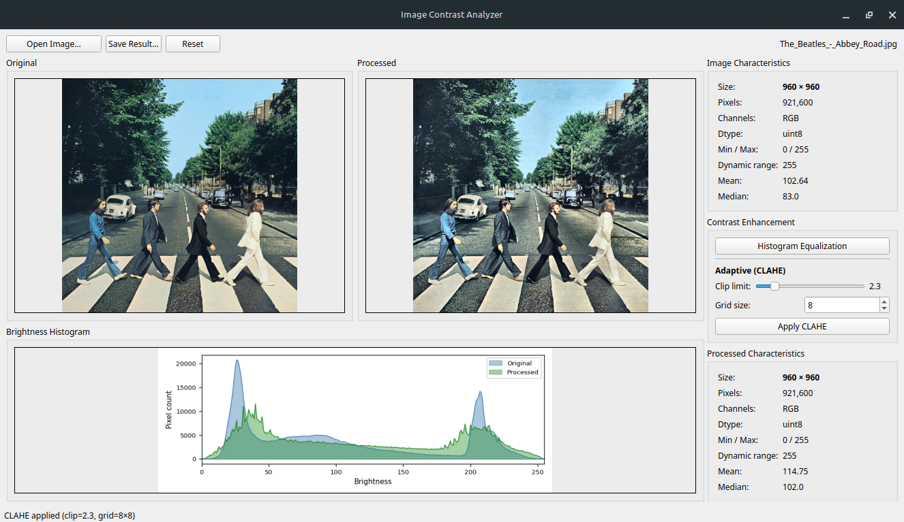

# Розробка системи розпізнавання облич та пошуку людей у відеопотоц
### Швагуляк Дмитро Варіант 2

- Create virtual environment

```python -m venv .venv```

- Activate python venv

Linux/macOS
```source .venv/bin/activate```

Windows
```venv\Scripts\activate.bat```

- Install dependencies

```pip install -r requirements.txt```


## Лабораторна робота №1

Run program with command

```python img_viewer/main.py```


